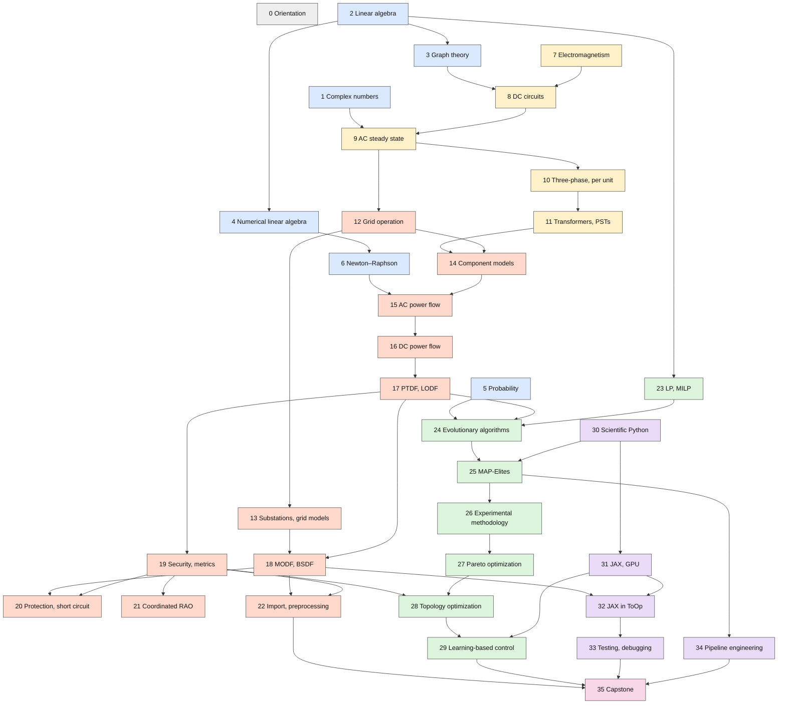

# Power Grid Topology Optimization

*From college algebra to reading, running, debugging and improving ToOp.*

## Introduction

This course has one goal: that a student who starts with sophomore algebra, calculus and physics can
**comprehend, use, debug and improve** the optimization code in [ToOp](https://github.com/eliagroup/ToOp),
the open-source GPU topology optimization engine by Elia Group and 50Hertz, and topology optimization software
in general. ToOp answers a question grid operators face every day: *which switching actions inside the
transmission grid remove overloads, both in normal operation and after any single outage, without paying
generators to change their output?*

Answering that question in software takes several bodies of knowledge, and the book is organized around them:

1. **Mathematics (Part I).** The DC load flow solver is applied linear algebra on a graph: a weighted
   Laplacian, a sparse solve, and low-rank matrix updates. AC validation needs complex numbers and Newton's
   method; evolutionary search needs basic probability.
2. **Electricity and circuits (Part II).** Grids are circuits. Nodal analysis, phasors, complex power,
   three-phase systems, per-unit values and transformer models turn physical equipment into equations.
3. **Power systems (Part III).** Substation topology and grid data, AC power flow and its DC approximation,
   the sensitivity factors that make ToOp fast (PTDF, LODF, MODF, BSDF), the N-1 security rules and metrics
   that define an acceptable grid state, short-circuit and protection limits on what can be switched, the
   European processes in which remedial actions are coordinated, and the preprocessing that turns a raw grid
   model into a search space. Chapters 17 and 18 are the mathematical core of the course.
4. **Optimization (Part IV).** Why the exact switching problem is hard, how evolutionary and
   quality-diversity search (MAP-Elites) work, how to run fair experiments with stochastic optimizers, how
   true Pareto multi-objective methods differ from the weighted sum ToOp uses, where ToOp sits among exact,
   heuristic and learning-based topology optimization methods.
5. **Computing (Part V).** A parallel track from scientific Python in the first semester to JAX on GPUs,
   ToOp's JAX internals, testing, debugging and profiling numerical code, and the engineering of a
   message-driven pipeline.

Chapter 0 opens the course by setting up ToOp and running it once as a black box, so that every later
chapter answers a question students have already asked. The capstone (Part VI) brings everything together on
the real code base, with a written brief for grid operators.

Labs and exercises use Jupyter notebooks with NumPy, pandas and matplotlib, Octave (with MATPOWER for power
flow), GeoGebra for geometric intuition, pandapower and pypowsybl, and ToOp itself. The
[course guide](course-guide.md) explains the schedule, tools and conventions.

## Chapters and their dependencies

Each arrow points from a prerequisite to the chapter that needs it, including the prerequisites of each
chapter's lab. To keep the chart readable, an arrow is omitted when the dependency already follows from a longer
path (2 → 8 is implied by 2 → 3 → 8); the "Prerequisites" line at the top of every chapter lists them all. The
same data drives the five-semester schedule in the [course guide](course-guide.md#five-semester-schedule). Node colors mark the parts: gray for
orientation, blue for mathematics, yellow for electricity and circuits, orange for power systems, green for
optimization, purple for computing and pink for the capstone.

The longest prerequisite chain runs **2 → 3 → 8 → 9 → 10 → 11 → 14 → 15 → 16 → 17 → 24 → 25 → 26 → 27 → 28 →
29 → 35**: linear algebra and graphs lead through circuits, component models and power flow to the
sensitivity factors, which become the fitness evaluator of the evolutionary and quality-diversity search, and
from there to multi-objective and learning-based topology optimization and the capstone.

## How each chapter is organized

Every chapter page has the same structure:

- **Weeks, semester and prerequisites**, with links.
- **Why it matters for ToOp**: the part of the code or documentation that depends on the chapter.
- **Topics** and **learning outcomes**.
- **Resources**: courses and videos, free texts, textbooks (with archive.org access status and Spanish
  editions), papers and documentation.
- **Lab**: a hands-on session, most of them on real ToOp code or data.
- **Exercises**: short pen-and-paper and computational problems.

Access labels, syllabus counts and the abbreviations used for ToOp source paths are defined in the
[conventions](course-guide.md#conventions).

The appendices record the evidence behind the plan: the [university syllabi](appendices/a-syllabi.md)
consulted, the [bibliography](appendices/b-books.md) with access status and Spanish editions, and a
[concept map of the ToOp code](appendices/c-toop-concept-map.md). The [glossary](appendices/d-glossary.md)
defines the acronyms and technical terms used throughout; hovering over an acronym anywhere in the book shows
its expansion.
